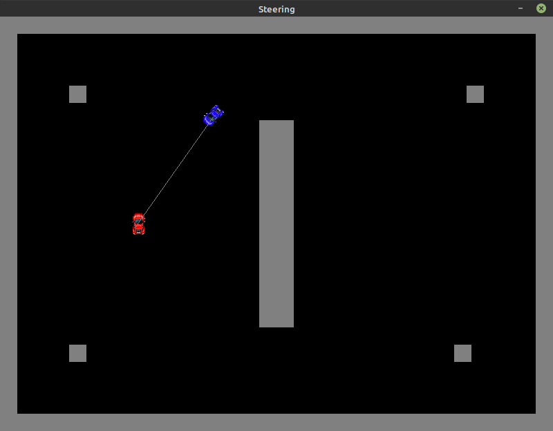

# Game AI Steering Behaviors

### Info
This repository was created in order to demonstrate three common steering behaviors:
1. Seek
2. Arrive
3. Wall Avoidance Seek

### Code and Build
The scenarios are contained within `./src/main/java/carsteering/test/*`  
The project was built using `java 14`  

There are currently no build / run scripts configured, so you will be responsible for setting up and building this project within your environment.
If you have any difficulties with this, please feel free to reach out, and I would be happy to help.

### Demonstration
[Click Here for Video Demonstration](https://drive.google.com/file/d/1Fkg4XE1MgVVgTDkORKLfwcne3rODYjl3/view?usp=sharing)

### Screenshots

###### Wall avoidance: veering away to avoid wall

 

###### Wall avoidance: locked on target

 

###### Arrive scenario: slowing down 

